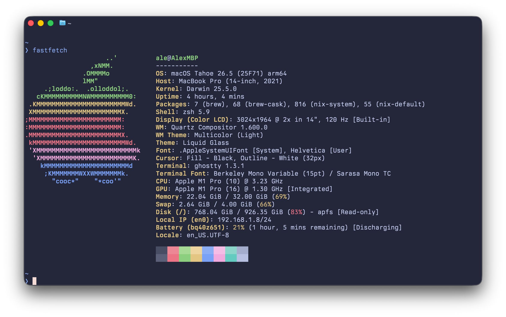

# dotfiles

> Acquiring good taste comes through using various things, discarding the ones you don't like and keeping the ones you do. if you never try various things, you will not acquire good taste.
>
> And what I mean by taste here is simply the honed ability to distinguish mediocrity from excellence. This will be highly subjective, and not everyone's taste will be the same, but that is the point, you should NOT have the same taste as someone else.
>
> Question the status quo, experiment, break things, do this several times, do this everyday and keep doing it.
>
> — *[If you don't tinker, you don't have taste](https://seated.ro/blog/tinkering-a-lost-art)*

My [nix-darwin](https://github.com/nix-darwin/nix-darwin) and NixOS configuration.

My daily driver is macOS because I prefer the Apple desktop environment. There are also a NixOS homelab server (running as a Proxmox VM) and NixOS VM setups mainly for experiments.



## Overview

* [Nix flakes](https://determinate.systems/blog/nix-flakes-explained/) provide a reproducible, pin-exact configuration shared across all machines.
* On macOS, [nix-darwin](https://github.com/LnL7/nix-darwin) manages system-level settings and packages declaratively.
* [home-manager](https://github.com/nix-community/home-manager) manages the user environment (dotfiles, packages, shell) across both macOS and NixOS hosts.

## Highlights

* Terminal: [Ghostty](https://ghostty.org/), using its built-in splits and tabs instead of a multiplexer
* Font: [Berkeley Mono™ Typeface](https://usgraphics.com/products/berkeley-mono)
* On macOS, [it sets](home/libs/wallpaper.nix) a beautiful wallpaper from [Raycast](https://www.raycast.com/wallpapers)
* General zsh configuration:
  * Prompt: [Starship](https://starship.rs) with a customized [Pure prompt](https://starship.rs/presets/pure-preset#pure-preset)
  * Theme: [Catppuccin Macchiato](https://catppuccin.com/) (Blue accent wherever available)
  * A number of handy [aliases](home/programs/zsh.nix) and [functions](home/files/shell/functions.zsh) and [shell scripts](home/files/shell/utilities)
  * [Automatic](home/files/shell/proxy.zsh) shell proxy propagation from macOS settings
* CLI apps of choice:
  * Editor: [Helix](https://helix-editor.com/)
  * Shell History: [Atuin](https://github.com/atuinsh/atuin)
  * Git TUI: [lazygit](https://github.com/jesseduffield/lazygit) ([a quick starter video](https://www.youtube.com/watch?v=CPLdltN7wgE))
  * File Manager: [Yazi](https://yazi-rs.github.io/) (invoke with `y` for shell integration)
  * Directory Navigation: [zoxide](https://github.com/ajeetdsouza/zoxide)
  * [fzf shell integration](home/programs/fzf.nix)
    * CTRL-T - Paste the path of selected files and directories
    * ALT-C - cd into the selected directory
  * [fzf-tab](https://github.com/Aloxaf/fzf-tab) for fuzzy-searching zsh completion results, including a [smart preview window](home/files/shell/fzf.zsh)

## Custom Shell Shortcuts & Functions

### Keybindings

Custom Zsh keybindings are configured in [`home/files/shell/keys.zsh`](home/files/shell/keys.zsh).

This is designed to work with default Ghostty macOS keybindings, or the iTerm2 Natural Text Editing keymappings preset.

<details>
<summary>Keybinding Reference</summary>

| Key Combo | Description |
|-----------|-------------|
| `Ctrl+U` | Delete everything to the left of the cursor |
| `Ctrl+X` then `Delete` | Delete entire line to the left of cursor |
| `Ctrl+B` | Jump to beginning of line |
| `Alt+Q` | Push aside current command line to type a new one (re-inserted on next prompt) |
| `Ctrl+X` then `Ctrl+_` | Redo last undone edit |
| `Ctrl+X` then `Ctrl+E` | Edit current command line in `$EDITOR` |
| `Alt+V` | Show next key combo's terminal code and description |
| `Alt+Shift+S` | Prefix current/previous command with `sudo` |

</details>

### Custom Functions

Shell functions are defined in [`home/files/shell/functions.zsh`](home/files/shell/functions.zsh).

A non-exhaustive list:

<details>
<summary>Video & Media</summary>

- `burnsrt <input.mp4> <input.srt> <output.mp4>` - Burn SRT subtitles into MP4 video
- `shrinkvid <input> <output> [bitrate]` - Compress video (uses hardware acceleration on macOS)
- `impaste > file.png` - Output clipboard image data to stdout
- `favicon <input.png>` - Generate multi-size favicon.ico from an image
- `dirtypdf <input.pdf> <output.pdf>` - Apply scanner effect to a PDF

</details>

<details>
<summary>Development & Git</summary>

- `gg <repo-url>` - Clone repo and cd into it
- `aic` - Generate conventional commit message using LLMs from staged changes
- `e [file]` - Edit file with `$VISUAL`, or open current directory if no argument
- `s <pattern>` - Search in files and visualize with [Delta](https://github.com/dandavison/delta?tab=readme-ov-file)

</details>

<details>
<summary>Directory & File Management</summary>

- `take <dir>` - Create directory and cd into it (equivalent to `mkdir -p && cd`)
- `tt` - Create and cd into a temporary directory
- `cdls <dir>` - Change to directory and list its contents
- `decrypt_pdfs <password>` - Decrypt all PDFs in current directory

</details>

<details>
<summary>Network & Diagnostics</summary>

- `t <host>` - Traceroute with [Trippy](https://trippy.rs/) (auto-updates GeoIP database)
- `tu <host>` - UDP traceroute with Trippy
- `https <domain> [port]` - Show TLS certificate details (default port: 443)
- `ttfb <url>` - Measure Time To First Byte with curl
- `listening [pattern]` - List all processes listening on TCP ports
- `pingu <host>` - Ping until success or cancelled
- `lip <ip>` - Lookup IP address details
- `dns <domain>` - Lookup IP address of domain's A record

</details>

<details>
<summary>Nix Utilities</summary>

- `nix-pkgdir <package>` - Get the Nix store path for a package
- `nr <package> [args...]` - Run a package from nixpkgs-unstable without installing
- `ns <pkg1> [pkg2...]` - Start a shell with packages from nixpkgs-unstable

</details>

## Usage Instructions

<details>

<summary>Commonly used commands in justfile</summary>

```shell
# Switch darwin configuration
just switch

# Updates all flake inputs
just update

# Updates one flake input
just update-input <flake-input-name>

# For more, run `just` to get all receipes.
```

</details>

<details>

<summary>Installation instructions on a new macOS machine without Nix installed</summary>

Full Disk Access has to be enabled for the terminal app via `System Settings > Privacy & Security > Full Disk Access` to overcome `Could not write domain com.apple.universalaccess; exiting` when applying user defaults.

```shell
xcode-select --install

# Clone the dotfiles
mkdir $HOME/.config
git clone https://github.com/birkhofflee/dotfiles $HOME/.config/dotfiles
```

Install [Determinate Nix](https://determinate.systems/) using the [macOS package](https://install.determinate.systems/determinate-pkg/stable/Universal), then:

```shell
# Temporarily mitigate 'too many open files' issue
# @see https://github.com/NixOS/nix/issues/6557
ulimit -n 4096

# Activate the configuration
nix run nixpkgs#nh -- darwin switch $HOME/.config/dotfiles --hostname AlexMBP --accept-flake-config
```

</details>

<details>

<summary>Provisioning nixos-server-01 (NixOS VM running on Proxmox)</summary>

[nixos-anywhere](https://github.com/nix-community/nixos-anywhere/) is used to remotely provision `nixos-server-01`, a Proxmox VM on the `homelab-nuc` PVE host. The target should be running a minimal NixOS installer ISO.

A [patch](packages/patches/nixos-anywhere-zram.patch) is used to support use of the tool on machines with low amount of RAM.

[nixos-facter](https://github.com/nix-community/nixos-facter) is used in conjunction to dynamically determine configurations from hardware.
See [`docs/deployment-instructions-nixos-server.md`](docs/deployment-instructions-nixos-server.md) for the full step-by-step procedure.

To apply new flake config after provisioning:

```shell
just switch-homelab
```

</details>

<details>

<summary>Provisioning nixos-desktop-01 (NixOS desktop VM)</summary>

`nixos-desktop-01` is a Proxmox KVM VM with GNOME DE. Remote desktop is provided by Gnome Remote Desktop on port 3389 (RDP).

#### 1. Build the VMA image

```shell
# Syncs working tree to nixos-server-01 and builds there (x86_64-linux).
just build-desktop-image
```

#### 2. Upload to PVE (run on nixos-server-01)

```shell
rsync -avz /tmp/dotfiles-build/result/vzdump-qemu-nixos-desktop-01.vma.zst root@homelab-nuc:/var/lib/vz/dump/
```

#### 3. Restore as VM on PVE

```shell
# SSH into homelab-nuc
# Assuming VM ID 201

# Stop the current VM
qm stop 201

# This creates (or replaces) VM 201 with our image.
# QEMU config is baked in. Starts the VM afterwards.
qmrestore /var/lib/vz/dump/vzdump-qemu-nixos-desktop-01.vma.zst 201 \
  --unique true \
  --storage local-lvm \
  --force \
  --start
```

`--unique true` is required — the image has a zeroed MAC address by default.

#### 4. Connect via RDP

Once the VM is up, it should be connected to Tailscale automatically (if the authkey given was valid).

If RDP fails somehow:

- RDP client-side config `use redirection server name:i:1` may be required to connect.
- On macOS, try to use [Thincast Remote Desktop Client](https://thincast.com/en/products/client) instead.
- SSH to the VM and check status using `sudo grdctl --system`, `ss -tlnp | grep 3389`, `sudo systemctl status gnome-rdp-setup gnome-remote-desktop`

#### 6. Apply config changes after provisioning

```shell
just switch-nixos-desktop
```

</details>

<details>

<summary>NixOS VM bootstrap instructions on macOS (VMware Fusion)</summary>

During my test, it appears that NAT DHCP in VMWare Fusion 13.6.4 doesn't work; use 13.6.3 instead (on macOS Sequoia 15.6.1).

Note that a desktop environment is yet to be properly implemented.

My personal settings are hardcoded in the [justfile](https://github.com/BirkhoffLee/dotfiles/blob/2ddd6e468fa073f8aa5a2d49c0063afda89522eb/justfiles/vm-vmware-fusion.just), you should inspect and modify accordingly, otherwise it is going to fail. After that, proceed to follow the instructions on configuring VMWare Fusion, which can be found in [this YouTube video by Mitchell](https://youtu.be/ubDMLoWz76U?si=pgso1-k7lUuGzAEg&t=86).

After setting the root password, execute the following to bootstrap the VM automatically:

```shell
# This will run `./vm-installer.sh`, that erases the disk, makes partitions on it, configures Nix for the next step.
$ just vm-bootstrap0 <vm-ipv4-address>

# Ensure the VM reboots into the disk instead of the installer.
# After that, run this to initiate the flake switch:
$ just vm-bootstrap <vm-ipv4-address>

# When it finishes, you will be able to SSH into the machine:
$ just vm-ssh [user]
```

</details>

<details>

<summary>NixOS VM bootstrap instructions on macOS (OrbStack)</summary>

Note that there's no GUI support on OrbStack Linux VMs. This setup focuses on usage only via SSH. It's fairly simple to setup on OrbStack compared to doing that on VMWare Fusion. This dotfiles intends to use the default system configurations provided by OrbStack, since it's heavily customized to be used with macOS shell.

```shell
# Ensure OrbStack is running, and create the VM:
$ just orb-create

# After that, simply run this to bootstrap it:
$ just orb-configure
```

</details>

## Other Notes

* Development Environments [should be managed using nix-shell](https://joshblais.com/blog/nixos-is-the-endgame-of-distrohopping/#development-environments).
* [Supercharge](https://sindresorhus.com/supercharge) has to be downloaded manually due to licensing constraints.
* While I'd like Nix to handle every app on my Mac, most GUI apps are better managed by Homebrew due to the conflicting nature of Nix and the self-updating capabilities of those apps.

## Articles

Here are some reads you might find interesting:

* [Faster and enjoyable ZSH (maybe)](https://htr3n.github.io/2018/07/faster-zsh/)
* [Comparison of ZSH frameworks and plugin managers](https://gist.github.com/laggardkernel/4a4c4986ccdcaf47b91e8227f9868ded)
* [fzf examples (fzf wiki)](https://github.com/junegunn/fzf/wiki/examples)
* [A simple dotfiles template to kick-start/bootstrap your zsh config](https://github.com/marlonrichert/zsh-launchpad)

Some completions setups:

* https://github.com/mashehu/dotfiles/blob/236af8d7d71989f9755a6ea29ee66e33cbbce1f8/zshrc#L89-L105
* https://github.com/finnurtorfa/zsh/blob/master/completion.zsh

## Acknowledgements

This project was heavily inspired by other open-source dotfiles. A non-exhaustive list:

* https://github.com/mitchellh/nixos-config
* https://github.com/malob/nixpkgs
* https://github.com/ahmedelgabri/dotfiles
* https://github.com/kornicameister/dotfiles/
* https://github.com/Aloxaf/dotfiles/tree/master/zsh/.config/zsh
* https://github.com/paulmillr/dotfiles
* https://github.com/mashehu/dotfiles
* https://github.com/finnurtorfa/zsh

Credits are given in the source code where applicable.

## License

This project is released under the [MIT License](LICENSE).
